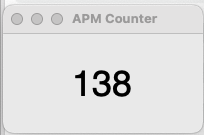

# APM Tracker

Feel the urge to larvae inject or build additional pylons while working? Do you feel a surge of productivity when you see some 500, 600+ APM number floating? Here is a minimum APM (action per minute) tracker. There are already some projects on Github if you search "action per minute", but they seems to lean to different aspect, some of them are good but doesn't support macOS. As usual, for small project like this, it's easier to write your own than modify someone else's code. 

It's really just one 60ish-line script that make a number floating window, if that's what you looking for, try it out.

## Environment

Require package [pynput](https://github.com/moses-palmer/pynput) to track.

Make sure to enable relavant permissions for input tracking.